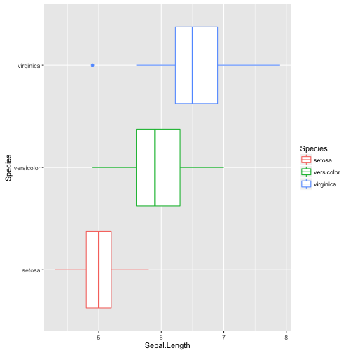
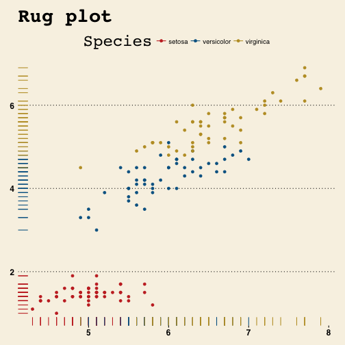

```r
library(ggplot2)
data(iris)
```

### Basics

```r
head(iris)
```

```
##   Sepal.Length Sepal.Width Petal.Length Petal.Width Species
## 1          5.1         3.5          1.4         0.2  setosa
## 2          4.9         3.0          1.4         0.2  setosa
## 3          4.7         3.2          1.3         0.2  setosa
## 4          4.6         3.1          1.5         0.2  setosa
## 5          5.0         3.6          1.4         0.2  setosa
## 6          5.4         3.9          1.7         0.4  setosa
```

```r
summary(iris)
```

```
##   Sepal.Length    Sepal.Width     Petal.Length    Petal.Width   
##  Min.   :4.300   Min.   :2.000   Min.   :1.000   Min.   :0.100  
##  1st Qu.:5.100   1st Qu.:2.800   1st Qu.:1.600   1st Qu.:0.300  
##  Median :5.800   Median :3.000   Median :4.350   Median :1.300  
##  Mean   :5.843   Mean   :3.057   Mean   :3.758   Mean   :1.199  
##  3rd Qu.:6.400   3rd Qu.:3.300   3rd Qu.:5.100   3rd Qu.:1.800  
##  Max.   :7.900   Max.   :4.400   Max.   :6.900   Max.   :2.500  
##        Species  
##  setosa    :50  
##  versicolor:50  
##  virginica :50  
##                 
##                 
## 
```

### 基本のiris データで描画

```r
g<- ggplot(iris,aes(Sepal.Length,Petal.Length))
g + geom_point() # Simple point plot
```


```r
g<- ggplot(iris,aes(Sepal.Length,Petal.Length,color=Species)) # 種類別に色を付ける
g + geom_point() # 同じgeom_pointだけど色が変わる
```


```r
g<- ggplot(iris,aes(Sepal.Length,Petal.Length,color=Species))
g + geom_point() + geom_rug()　# rug plot
```


```r
g<- ggplot(iris,aes(Sepal.Length,Petal.Length,color=Species))
g + geom_point() + geom_density2d()　# こんなのも描けるよ、的な例。
```


```r
ggplot(iris, aes(x=Sepal.Length)) + geom_histogram(binwidth=0.1)
```


```r
ggplot(iris, aes(x=Sepal.Length)) + geom_density(fill=rgb(1,0,0,0.5))
```


```r
ggplot(iris, aes(x=Sepal.Length)) +
  geom_density(aes(col=Species,fill=Species), alpha=0.5)
```


### 図のタイトルやx軸、y軸の書き方


```r
g<- ggplot(iris,aes(Sepal.Length,Petal.Length,color=Species))
g + geom_point() + geom_rug()　+
  ggtitle("Rug plot") +  # タイトル
  xlab("Sepal Length") +
  ylab("Petal Length")
```


### Box Plot


```r
g <- ggplot(iris,aes(Species,Sepal.Length,color=Species))
g + geom_boxplot()  # geom_boxplot()に変えるだけ
```


```r
ggplot(iris,aes(Species,Sepal.Length,color=Species)) + geom_boxplot() + theme(axis.text.y=element_text(size=25), axis.text.x=element_text(angle=45, hjust=1, size=15), title=element_text(size=25))
```


縦横を変える方法

```r
g <- ggplot(iris,aes(Species,Sepal.Length,color=Species))
g + geom_boxplot() +
  coord_flip() # 横に変換
```




```r
g <- ggplot(iris,aes(Species,Sepal.Length,color=Species))
g + geom_boxplot() + geom_jitter()　
```


### Bar chart

```r
g <- ggplot(iris,aes(Species)) 
g + geom_bar()
```


```r
g <- ggplot(iris,aes(Species,col=Species,fill=Species)) 
g + geom_bar()
```


```r
#install.packages("ggthemes")
library(ggthemes)
```
### themeを使った例

```r
g<- ggplot(iris,aes(Sepal.Length,Petal.Length,color=Species))
g + geom_point() + geom_rug()　+
  ggtitle("Rug plot") +  # タイトル
  xlab("Sepal Length") +
  ylab("Petal Length") +
  theme_wsj() + # Wall Street Journal 風
  scale_colour_wsj() # ポイントの色もWSJ風になる
```




## Further plot 
aesを使う場所による色分けの違い

```r
g<- ggplot(iris,aes(Species,Sepal.Length,color=Species))
g + geom_boxplot() + geom_dotplot(binwidth= 0.07,binaxis="y",stackdir="center")
```


```r
g<- ggplot(iris,aes(Species,Sepal.Length,color=Species,fill=Species))
g + geom_boxplot() + geom_dotplot(binwidth= 0.07,binaxis="y",stackdir="center")
```


```r
#いい感じバージョン
g<- ggplot(iris,aes(Species,Sepal.Length,color=Species))
g + geom_boxplot() + geom_dotplot(aes(fill=Species),binwidth= 0.07,binaxis="y",stackdir="center")
```


